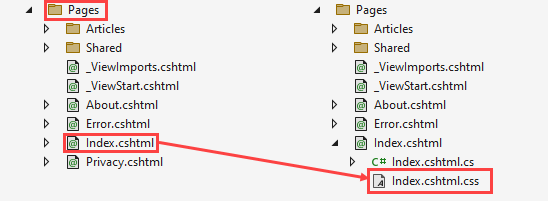
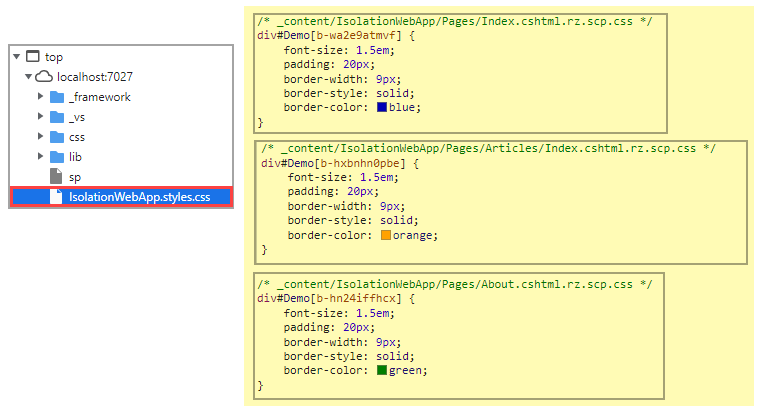
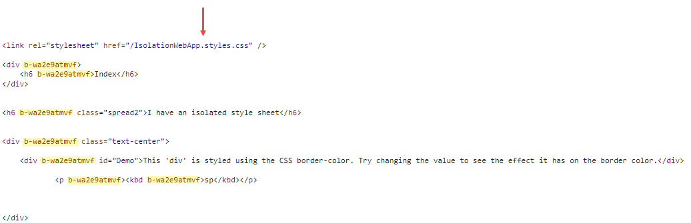
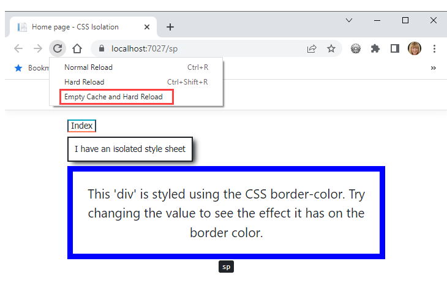

# Razor Pages CSS Isolation

Learn how to prevent dependencies on global styles and helps to avoid styling conflicts among components and libraries of styles in an application where most styles reside under `wwwroot\css\site.css` by using CSS isolation scopes CSS to Razor components, which can simplify CSS and avoid collisions with other components or libraries.

# Pages

There are three pages, <kbd>Index</kbd>, <kbd>About</kbd> and <kbd>Articles\\Index</kbd>.

# site.css

This is where we define `global` styles for a Razor pages web application.

# Razor runtime compilation
Css isolation may not working with Razor runtime compilation

# Steps to setup CSS Isolation on a Razor Page

We will begin with the main page <kbd>Index</kbd>.

1. Right click on `Pages` folder
1. Add a new item, select text file
1. Save the text file as `Index.cshtml.css` which will nest the new file under `Index.cshtml` as shown below.
1. Add styles into `Index.cshtml.css`
1. Open `Index.cshtml` and add `<link rel="stylesheet" href="~/@(nameof(IsolationWebApp)).styles.css" />`. Replace `IsolationWebApp` with the namespace of your project (easy to get from Program.cs)
1. In `Index.cshtml` add one or more elements that use the styles in `Index.cshtml.css`
1. Run the application



Next repeat the above steps for other pages, in the project presented <kbd>About</kbd> and <kbd>Articles\\Index</kbd> have the exact sample styles as <kbd>Index</kbd> but have enough changes to styles so that when running the app the person running the app can see that the styles are isolated to their respective page.

# Look under the covers

While running the project, open the browser web tools, travese to, in this case IsolationWebApp.styles.css and note there are sections for each page and note the [b...] identifiers which are injected into the respective page.



</br>




# Caveats

In after change a style, running the project the changes are not reflected open the browser's development tools then back in the browser empty the cache and perform a hard reload.



When adding a link for the style sheet do not use

```css
<link rel="stylesheet" href="~/IsolationWebApp.styles.css" />
```

Use

```css
<link rel="stylesheet" href="~/@(nameof(IsolationWebApp)).styles.css" />
```

This is because in the first example if the namespace changes the style sheet will not be located while in the second example it will be as when renaming the namespace in Visual Studio it will be in `nameof(IsolationWebApp)` when using `nameof`.

# Summary

Visual Studio makes it easy to prevent dependencies on global styles and helps to avoid styling conflicts between other pages and components by following the instructions provided.